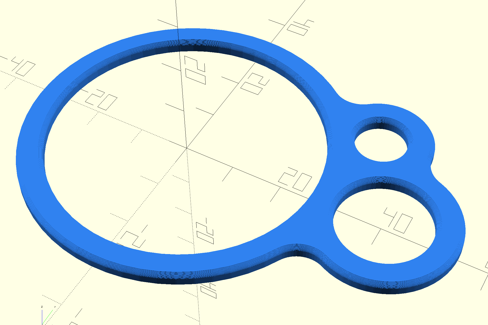

# OpenSCAD Eyelet Generator

A parametric eyelet generator for 3D printing, designed for outdoor and camping gear. Compatible with [MakerWorld's Parametric Model Maker (PMM)](https://makerworld.com) — users can customize parameters directly on the model page.

## Eyelet Types

| # | Type | Description |
|---|------|-------------|
| 1 | **Simple O** | Single ring with inner and outer diameter |
| 2 | **Simple 8** | Two rings side by side, outer edges touching |
| 3 | **Double O Egg** | Two rings inside a smooth egg-shaped envelope |
| 4 | **Snowman** | Three rings in a row, outer edges touching |
| 5 | **Triangle** | Three rings at triangle vertices |
| 6 | **Joined 8** | Two rings with connected inner holes |
| 7 | **Joined Snowman** | Three rings in a row with connected inner holes |
| 8 | **Simple D** | Half ring with a flat closing wall (D-shape) |
| 9 | **Double D** | Ring split in half by a center dividing wall |
| 10 | **Simple S** | S-shaped curve from two partial-circle arcs |

## Parameters

### Dimensions
- **Wall thickness** (1–10 mm) — thickness of the ring wall
- **Height** (1–10 mm) — extrusion height
- **Base inner diameter** (1–150 mm) — inner diameter of the primary ring
- **Second inner diameter** (1–150 mm) — inner diameter of the second ring
- **Third inner diameter** (1–150 mm) — inner diameter of the third ring

### 3D Edge Filleting
- **Bottom edge radius** (0–10 mm) — rounds the bottom edge
- **Top edge radius** (0–10 mm) — rounds the top edge
- **Fillet resolution** (1–30 layers) — smoothness of edge rounding

### 2D Smoothing
- **Connection fillet radius** (0–10 mm) — rounds V-junctions where rings meet

### S Shape — Hook 1 & Hook 2
- **Percentage of circle** (70–100%) — controls how much of the circle each S-hook covers

### Color
- Color picker (hex string) — visible in MakerWorld PMM

## Usage

### Local (OpenSCAD)
1. Open `eyelet-generator.scad` in [OpenSCAD](https://openscad.org)
2. Use the Customizer panel (Window → Customizer) to adjust parameters
3. Press F5 for preview, F6 for full render
4. Export STL/3MF for 3D printing

### MakerWorld PMM
1. Upload `eyelet-generator.scad` to [MakerWorld](https://makerworld.com)
2. Users click "Customize" on the model page
3. Parameters appear as interactive sliders and dropdowns
4. Users download ready-to-print 3MF/STL

## Technical Details

- **OpenSCAD version:** 2021.01+
- **No external dependencies** — uses only built-in OpenSCAD functions
- **PMM-compatible** — follows OpenSCAD Customizer conventions with `// [min:step:max]` sliders and `// [value:Label]` dropdowns

### Key Techniques

- **Concave fillet** (`offset(-r) → offset(+r)`) — rounds V-junctions where rings touch
- **Convex fillet** (`offset(+r) → offset(-r)`) — rounds outward-pointing corners
- **Layered edge fillet** — independent top/bottom 3D edge rounding via layered `linear_extrude` with cosine-eased `offset()`
- **Triangle layout** — ring positions computed via law of cosines from pairwise distances
- **S-shape** — built as `hull()` of circles along arc paths, creating a tube around the curve

## License

CC-BY-SA-4.0

## Authors

- **Vilda** (Vilém Kužel) — design and geometry
- **Klepeto** — implementation and testing